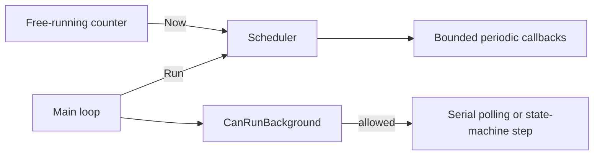

# Bare-metal deadline-aware scheduler

[](https://github.com/burdursis/baresched/actions/workflows/ci.yml)

Current version: [0.1.0](VERSION).

A small C++11 scheduler for systems that need periodic callbacks alongside short
polling or state-machine steps. It selects work using allowed start lateness and
completion deadlines, checks non-preemptive blocking against configured WCETs,
and records timing diagnostics. The implementation is one header with fixed
storage for a compile-time capacity of 1 to 32 tasks and no dynamic allocation.

## What it provides

- Cooperative callbacks: one `Run()` call executes at most one task.
- Periods and phase offsets, with no accumulated drift or catch-up bursts.
- Per-task start tolerance, deadline, and worst-case execution time (WCET).
- Admission checks for bounded background work.
- Runtime enable/disable, period changes while disabled, and diagnostics.
- `uint32_t` ticks independent of physical timer resolution.

This is not an RTOS: there is no preemption, context switching, separate task
stack, mutex, or multicore support. Long callbacks still block the main loop.
WCETs must be validated on the target, and compared timestamps must remain less
than `2^31` ticks apart.



## Minimal integration

The application supplies the hardware functions below. All timing arguments use
the same unit as `ReadTicks()`; here one tick represents one microsecond.

```cpp
#include "scheduler.hpp"

uint32_t ReadTicks();
void SampleSensorStep();
void PollSerialStep();

void SensorCallback(void*)
{
    SampleSensorStep(); // Must complete within 50 ticks.
}

void ApplicationLoop()
{
    Scheduler<8> scheduler(&ReadTicks);
    // callback, context, period, offset, allowedLateness, relativeDeadline, wcet
    const int id = scheduler.AddTask(&SensorCallback, nullptr, 10000, 0, 50, 100, 50);
    if (id < 0)
    {
        return; // Handle initialization failure in the application.
    }
    scheduler.Start(ReadTicks());
    for (;;)
    {
        scheduler.Run();
        if (scheduler.CanRunBackground(10))
        {
            PollSerialStep(); // Must complete within 10 ticks.
        }
    }
}
```

Choose `Scheduler<8>`, `Scheduler<16>`, or `Scheduler<32>` to match your task budget.
`Scheduler<MaxTasks>` requires `1 <= MaxTasks <= 32`, enforced by `static_assert`;
`Scheduler<0>` and `Scheduler<33>` do not compile. Smaller capacities allocate
fewer task records and scan fewer slots; both bitmasks remain `uint32_t`.
Use `Scheduler<32>` when migrating an existing 32-slot application.

Register tasks before `Start()`. Keep the clock function and callbacks valid for
the scheduler's lifetime. Use scheduler APIs from one main-loop context;
callbacks must return without throwing. Admission is based on clock snapshots,
so scheduler overhead and interrupt latency need a budget too.

## Callback task control

A callback may safely call `scheduler.DisableTask(taskId)` on itself. Its current
invocation still runs to completion, including execution-time and lateness
diagnostics. Later iterations skip it until the main loop re-enables it.
After the callback returns, `EnableTask(taskId)` schedules a new first release
after one full period; `EnableTask(taskId, 0)` makes it immediately eligible.

The following sequence **inside the same callback is unsupported**, even though
the individual calls can return true:

```text
scheduler.DisableTask(taskId);
scheduler.SetPeriod(taskId, newPeriod);
scheduler.EnableTask(taskId);
```

After the callback returns, `Dispatch()` assigns `nextRelease = release + period`
using the captured original release and the current period, overwriting the
release established by `EnableTask()`. Defer period changes and re-enable to the
main loop. See [runtime-control details](docs/design.md#self-disable-and-callback-reconfiguration)
and the [deterministic tests](tests/runtime_control_test.cpp).

## Build, test, and run

Install CMake 3.20+, GoogleTest, and a host compiler that supports its requirements
(the tested GoogleTest 1.14 package requires C++14). The scheduler and example
require only C++11. Make commands additionally require GNU Make and a POSIX shell.
Coverage uses GCC, a matching `gcov`, and `gcovr`. See
[setup instructions](docs/testing.md) for dependency installation.

```sh
cmake -S . -B build/debug -DCMAKE_BUILD_TYPE=Debug
cmake --build build/debug --parallel 2
ctest --test-dir build/debug --output-on-failure
./build/debug/examples/basic/scheduler_example
```

The [example](examples/basic/main.cpp) uses a simulated clock and demonstrates
fast/slow tasks, offsets, background polling, a period change, and diagnostics.
It does not measure Linux scheduling latency.

Convenience commands:

```sh
make test
make example
make coverage
```

Coverage produces [HTML details](build/coverage/reports/index.html) and
[Cobertura XML](build/coverage/reports/coverage.xml) after the target runs.
Normal builds have no coverage instrumentation.

## CI

The [GitHub Actions workflow](.github/workflows/ci.yml) runs on pushes and pull
requests using Ubuntu 24.04. It configures a GCC Debug build with the existing
warning flags and GoogleTest integration, checks valid/invalid template capacities,
and builds the unit tests and example. Tests run through
`ctest --test-dir build/ci --output-on-failure --no-tests=error`, so failures include
their test output.

Coverage uses the existing `SCHEDULER_ENABLE_COVERAGE` CMake option and GCC/gcov.
After CTest, gcovr prints a summary and generates Cobertura XML plus detailed HTML.
Only production code in `include/` contributes to percentages; tests, GoogleTest,
third-party code, and generated build files are excluded. No coverage threshold
is enforced.

Download the `coverage-reports` artifact from the workflow run, extract it, and
open `index.html`; `coverage.xml` is included in the same archive. Reports are
retained for 14 days and are also generated after test failures when the build
succeeded. A live coverage badge is omitted to avoid adding a separate publishing
service or repository-write automation.

## Repository map

```text
CMakeLists.txt, Makefile   Build and development entry points
VERSION                   Project version read by CMake
LICENSE                   MIT license
include/scheduler.hpp     Header-only production implementation
tests/                    GoogleTest cases, fake clock, and test CMake target
examples/basic/           Runnable example and its CMake target
docs/                     Design, timing, API, diagnostics, and testing guides
scripts/coverage.cmake    Counter cleanup, tests, and HTML/XML reporting
```

Generated files stay under `build/`, which Git ignores. Firmware can include the
header directly or use `add_subdirectory()` and link `scheduler::scheduler`.
Set `BUILD_TESTING=OFF` and `SCHEDULER_BUILD_EXAMPLES=OFF` for a library-only build;
neither GoogleTest nor host I/O is then needed.

Start with the [documentation index](docs/README.md):
[design and flows](docs/design.md), [timing model](docs/timing-model.md),
[API contract](docs/api.md), [diagnostics](docs/diagnostics.md), and
[testing and coverage](docs/testing.md).

Licensed under the [MIT License](LICENSE).
