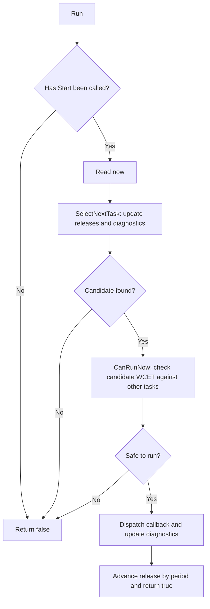
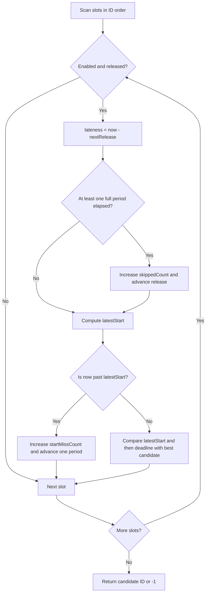
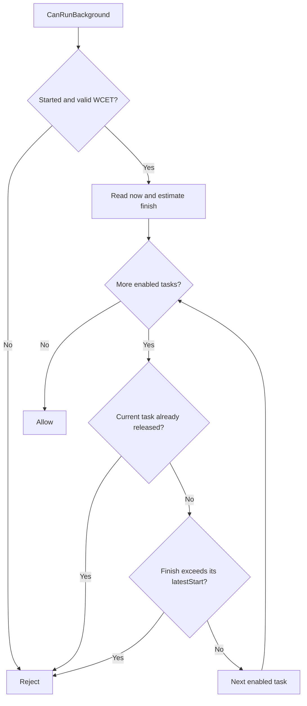
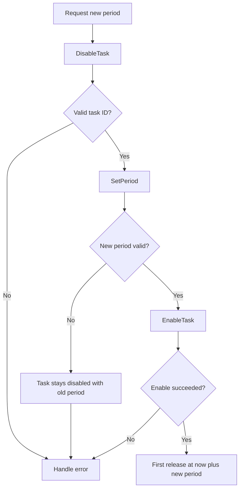
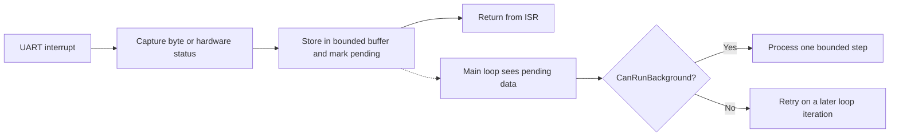

# Design and execution flows

## Responsibilities and storage

`Scheduler<MaxTasks>` decides **when** a callback runs. The application owns **what** it does:
protocol state, flash operation progress, sensor state, and buffer management.
The scheduler stores a callback and a borrowed `void*` context. It neither copies
nor frees that context.

| Field / type | Responsibility |
| --- | --- |
| `Task tasks_[MaxTasks]` | Callback, context, timing parameters, next release, diagnostics |
| `usedMask_` | Registered slots; disabling a task does not free its slot |
| `enabledMask_` | Tasks participating in selection and admission checks |
| `started_` | Whether `Start()` has been called |
| `now_` | Application-provided `uint32_t (*)()` counter function |
| `TaskDiagnostics` | Per-task counters and timing measurements |

Storage is embedded in each scheduler object. A stack-allocated scheduler also
places its fixed task storage on that stack. Production code uses no heap, STL
containers, per-task stack, or dynamic priority structure. Each scan visits at
most `MaxTasks` slots, so selection and admission are `O(MaxTasks)`. The capacity
is constrained at compile time to 1..32, matching the two `uint32_t` masks.
The masks stay 32 bits wide even for smaller capacities; only bits 0 through
`MaxTasks - 1` are used. The task array contains exactly `MaxTasks` records, so
smaller instances use less memory and have a smaller scan bound.
Task execution time itself depends on the application.

## Cooperative execution

Callbacks run to completion. The scheduler cannot switch to another callback
until the current one returns; hardware interrupts may still occur. A large
operation, such as flash programming, should be split into short state-machine
steps. WCET is the budget for **one step**, not the entire multi-step operation.

A `Run()` call dispatches at most one callback. `false` means no callback ran; the
scan may still have advanced missed releases and changed diagnostic counters.
Keep calling `Run()` even after it returns false.

## Selection and blocking

Only released, enabled tasks are candidates. The scheduler chooses the earliest
`latestStart = nextRelease + allowedLateness`, breaks ties with the earliest
completion deadline, and retains the lowest slot ID on a full tie.

Before dispatch, `CanRunNow()` checks the estimated finish `now + candidate.wcet`
against **every other enabled task's** latest-start point, including tasks not yet
released. If any point would be exceeded, the candidate is blocked. Equality is
allowed. No alternative candidate is tried during that call.

For example, a ready task needs 20 ticks, while another task is released at tick
10 with allowed lateness 5. At tick 0 the first task cannot run: its estimated
finish 20 would exceed the other's latest start 15. The main loop must wait and
call `Run()` again. Ready work can therefore coexist with an idle CPU. This is a
simple conservative policy, not a complete schedulability analysis or a guarantee
of maximum CPU utilization.

## Background work and serial polling

Short non-periodic work can remain in the main loop: inspect RX buffers, poll a
hardware flag, or advance one state-machine step. Call `CanRunBackground(wcet)`
immediately before each operation. It rejects work if the scheduler has not
started, the WCET is invalid, any enabled task is already released, or the
estimated finish would exceed an enabled task's latest start.

The check does not advance releases or modify diagnostics. With no enabled tasks,
a valid WCET is accepted. It is a snapshot, not a reservation; check separately
before each background operation. Call `Run()` to process expired releases before
retrying background work. A polling function must not wait for incoming bytes or
hardware completion. If an operation requires a regular release, register it as a
periodic callback instead.

## Runtime reconfiguration

Perform period changes and re-enable from the main loop between callbacks.
A callback may disable itself. Disabling removes a task from selection and
protection checks but retains its slot and diagnostics.

Check every return value. Default enable waits a full period; enable with delay
0 makes the task immediately eligible. A custom delay starts a new timeline at
`now + firstDelay`. Start offsets apply to `Start()`, not runtime enable. See the
[API contract](api.md) for pre-start and repeated-enable behavior.

### Self-disable and callback reconfiguration

A callback may call `DisableTask(itsOwnId)`. Clearing the enabled bit does not
abort the current callback or release its storage. `Dispatch()` still records
the invocation's diagnostics and advances `nextRelease` by a period, while the
task remains disabled. Further `Run()` calls skip it, and other enabled tasks
retain their own release grids. Disabling an already disabled registered task
returns true; invalid IDs return false without changing task state.

Externally enabling the task after the callback returns replaces the old release
with a new timeline. Default enable waits a full period from the enable-time
clock sample; explicit delay 0 makes it immediately eligible. Neither clears
diagnostics. The same rules apply across uint32 counter wrap-around within the
half-range horizon.

Do not disable, change period, and re-enable the executing task inside one
callback. The individual calls can return true, but `Dispatch()` captured the
original release before the callback and later assigns
`nextRelease = release + task.period`. It uses the updated period and overwrites
the release set by `EnableTask()`.

For example, a callback released at 0 starts at 5 and reaches reconfiguration at
15. Changing its period to 200 and calling default enable sets a release of 215.
On return, dispatch overwrites this with `0 + 200 = 200`. The task can run at 200,
earlier than the requested 215. This is an unsupported pattern, characterized by
`UnsupportedCallbackReconfigurationHasItsEnableReleaseOverwrittenByDispatch` in
[runtime-control tests](../tests/runtime_control_test.cpp); the observed outcome
is not a supported reconfiguration contract. Request the change from the callback
and apply it in the main loop instead. No scheduler behavior was changed to
support callback reconfiguration.

## Interrupt model

Use interrupts to capture minimal hardware state, move a small amount of data
into an application-owned buffer, and set pending state. Protocol parsing,
state-machine work, and flash operations belong outside the ISR.

The application is responsible for synchronization and overflow handling in
shared buffers. The scheduler is not thread-safe or ISR-safe. Do not invoke its
APIs concurrently or call `Run()`/`Start()` recursively from callbacks. Safe
self-disable does not add concurrency support. Interrupt execution during a
callback contributes to the measured callback duration.

## Known limits and observed behavior

- There is no preemption, multicore scheduling, mutex, priority inheritance,
  dynamic task allocation, or queue of pending instances for the same task.
- Callbacks must return without throwing. Self-disable is supported; defer period
  changes and re-enable until after the callback returns. Long or blocking
  callbacks can still block the system, even after admission succeeds.
- WCET is an assumption. An overrun is recorded after return; it cannot be stopped.
  Validate budgets under representative interrupt load on the actual hardware.
  Host/Linux timings are not evidence of hard real-time behavior.
- Register tasks before `Start()`. Registration after startup is not rejected,
  but initializes release to 0 instead of the current epoch. That behavior is
  retained, not presented as a supported way to add runtime work.
- Repeated `Start()` calls rebuild enabled task timelines without clearing counters.
- A valid, fast, consistent `Now` function is required; the constructor does not
  reject a null pointer. [Half-range assumptions](timing-model.md) apply to all
  comparisons, including sums and differences of otherwise valid parameters.

### Admission-to-dispatch gap

The design description originally implied that every callback starting after
its latest-start point would be dropped. The actual implementation checks the
clock sampled in `Run()` during selection and WCET admission, then reads it again
in `Dispatch()` for measurement. It does **not** repeat the admission checks.
An interrupt or scheduler overhead between samples can therefore cause a late
callback to run; `maxLateness` records the measured delay, but `startMissCount`
does not increase for that dispatch.

This cleanup preserves that behavior and records it in
`DispatchOverheadIsMeasuredButStartWindowIsNotRechecked`. Account for scheduler,
clock-read, and interrupt costs in target timing budgets. A future change to
refresh admission near dispatch needs explicit semantics and tests; even a fresh
check cannot eliminate interrupts between checking and calling the callback.

## Why no preemption, and possible extensions

Cooperative execution avoids register context management, per-task stacks,
locking protocols, and priority-inversion machinery. For a small task set with
bounded callbacks, a fixed array is easier to inspect and measure than a heap or
RTOS-like task framework.

Possible future additions include offline schedulability checks, scheduler
latency measurements, one-shot tasks, and explicit runtime-registration rules.
Add them only for demonstrated needs. Preemption would be a separate architectural
change, justified only after bounded-step design and measured timing show that
non-preemptive blocking cannot meet requirements. It is not implemented here.
